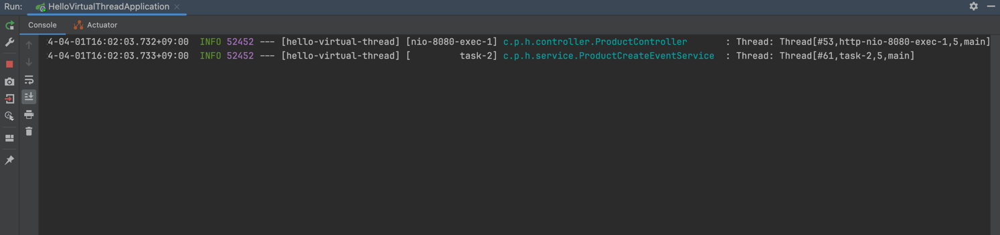
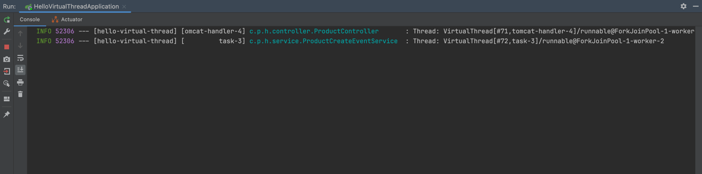
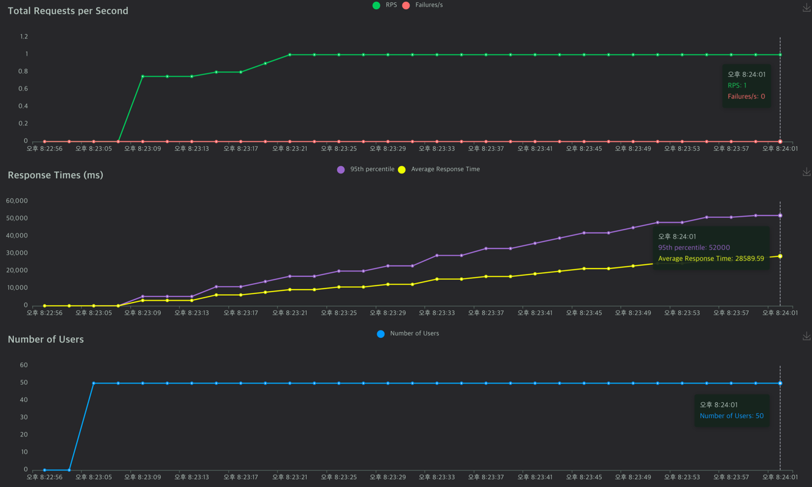
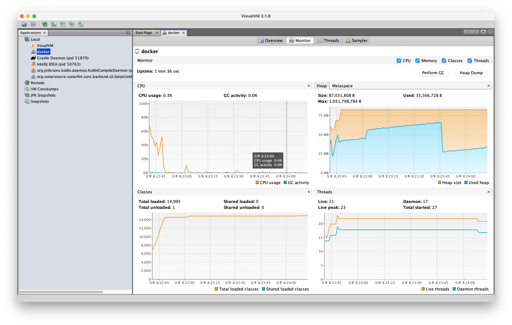
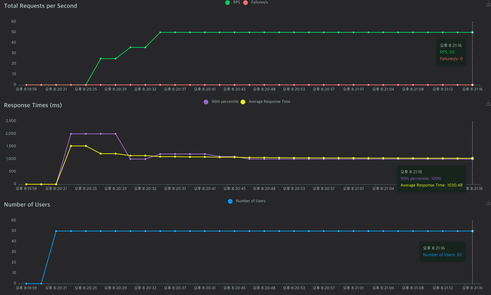
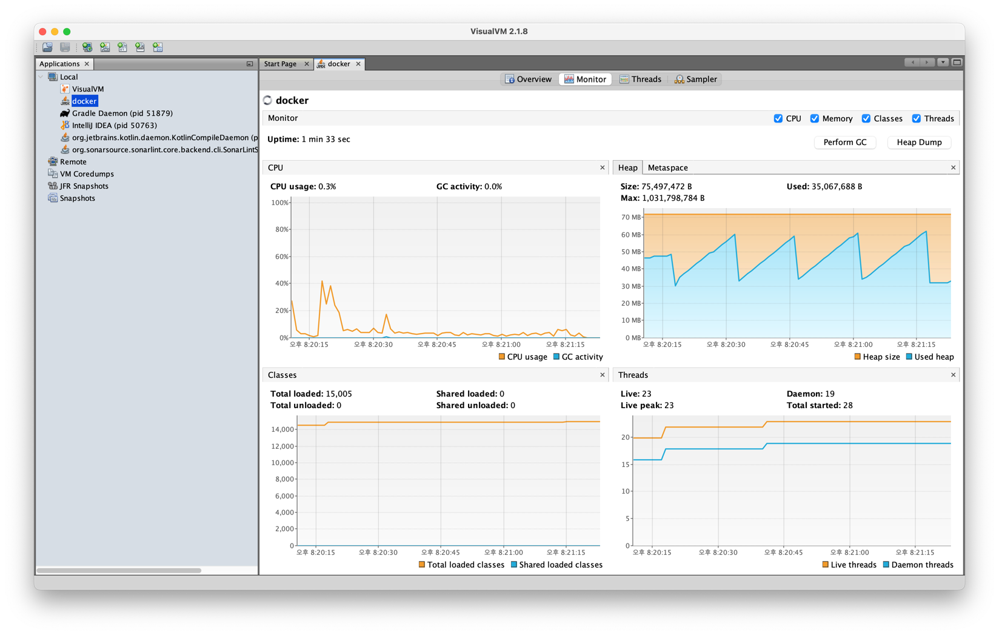

# Hello Virtual Thread

## Virtual Thread 란?

[Java Virtual Thread](./virtual-thread.md)

## 가상스레드를 사용하는 방법

Java21을 사용하면 스프링 부트 3.2부터 다음과 같이 `application.yml` 에 다음과 같은 설정을 추가해서 간단하게 가상 스레드를 사용할 수 있다.

```yaml
spring:
  threads:
    virtual:
      enabled: true
```


다음과 같이 설정하고 `http/product-api.http`에서 상품을 생성하는 API를 호출했을 때 현재 어떤 스레드를 사용하는지 로그를 찍어보도록 하자.

### 적용 전



- 상품을 생성하는 스레드는 그냥 스레드에서 동작하고, 비동기적으로 `ProductCreateEvent`를 만드는 것도 `AsyncConfig`에서 지정한 스레드 풀의 스레드를 사용하는 것을 확인할 수 있다.

### 적용 후



- 상품을 생성하는 스레드 및 비동기적으로 `ProductCreateEvent`를 생성하는 스레드도 모두 가상 스레드를 사용하는 것을 확인할 수 있다.

## 가상 스레드를 적용하지 않은 경우, 가상스레드를 적용한 경우 각각 부하테스트

### Environment

- web container는 `tomcat.server.threads.max=1`로 설정하여, 최대 스레드가 1개로 서버가 동작되도록 설정한다.
- Dockerfile 빌드 시 System Property로 `-Djdk.virtualThreadScheduler.maxPoolSize=1`과 같이 설정해준다.
  - 이를 통해 가상스레드 스케줄러가 최대 1개의 플랫폼 스레드를 사용하도록 설정한다.
- 가상스레드를 적용한 경우와 적용하지 않은 경우 각각 부하테스트에서 50명의 가상 유저가 동시에 `GET /health` 요청을 보내도록 한다.
  - `GET /health` API 는 다음과 같이 구현돼 있다.

```kotlin
@GetMapping("/health")
fun healthCheck(): String {
    log.info("Thread: {}", Thread.currentThread())
    Thread.sleep(1000L) // Blocking
    return "OK"
}
```

### 가상 스레드를 적용하지 않은 경우

```text
## Locust 폴더로 이동
cd locust/

## 테스트 실행: 아래 명령어를 실행 후 `localhost:8089`에서 테스트를 실행시킨다.
docker compose -f docker-compose-platform.yml up -d

## 종료 시
docker compose -f docker-compose-platform.yml down
```

#### 부하테스트 실행 결과





- 스레드가 1개이기 때문에, 50명의 유저가 요청을 보내도 1개만 응답이 가능하다. 따라서 RPS가 1인 것을 확인할 수 있다.
  - 1개의 요청이 처리되는 동안 나머지 응답은 대기하므로 응답시간이 계속 증가하는 것을 확인할 수 있다.

### 가상 스레드를 적용한 경우

```text
## Locust 폴더로 이동
cd locust/

## 테스트 실행: 아래 명령어를 실행 후 `localhost:8089`에서 테스트를 실행시킨다.
docker compose -f docker-compose-virtual.yml up -d

## 종료 시
docker compose -f docker-compose-virtual.yml down
```

#### 부하테스트 실행 결과 with VisualVM Monitoring





- 사용하는 플랫폼 스레드는 1개이지만, 가상 스레드를 만들어서 응답을 하기 떄문에 RPS가 50인 것을 확인할 수 있다. 
  - 50명의 유저가 있고, 응답하는데 1초가 걸리기 때문에 자연스럽다.
- 가상스레드가 계속 생성되고 GC로 사라지기 때문에, Heap 영역의 메모리가 올라갔다 내려갔다 하는 것으로 추측된다.

## Reference

- https://docs.oracle.com/en/java/javase/21/core/virtual-threads.html
- https://openjdk.org/jeps/444
- https://d2.naver.com/helloworld/1203723
- https://techblog.woowahan.com/15398
- https://docs.spring.io/spring-boot/docs/current/reference/htmlsingle/#features.spring-application.virtual-threads
