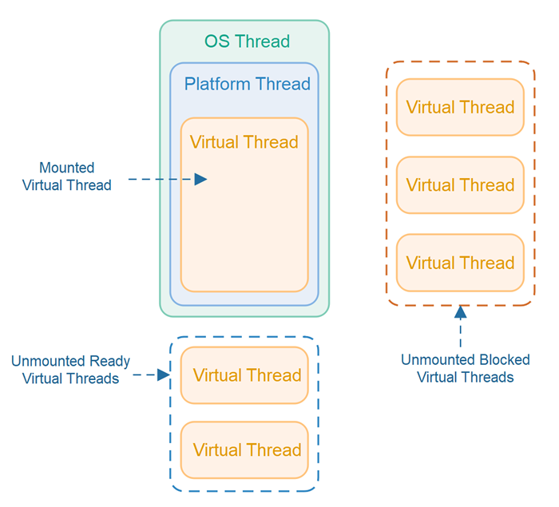
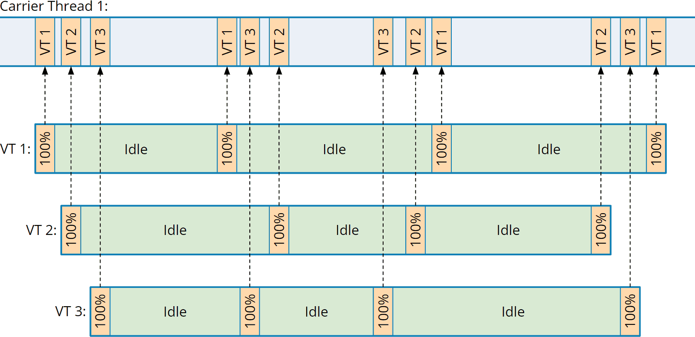

# Java Virtual Thread


- 출처 : [Java Virtual Threads](https://jenkov.com/tutorials/java-concurrency/java-virtual-threads.html)

## Platform Thread(플랫폼 스레드)

플랫폼 스레드는 운영체제의 스레드를 감싸는 래퍼이다. 플랫폼 스레드는 기본 OS 스레드에서 Java 코드를 실행하고, 플랫폼 스레드의 전체 수명기간 동안 해당 OS 스레드를 캡처한다. 따라서 사용 가능한 플랫폼 스레드의 수는 운영체제 스레드의 수로 제한된다.

## Virtual Thread(가상 스레드)

가상 스레드는 OS 스레드에서 코드를 실행하지만 특정 스레드에 묶여 있지 않는다. 이는 많은 가상 스레드가 동일한 운영체제 스레드에서 Java 코드를 효율적으로 실행할 수 있음을 의미한다. 가상 스레드에서 실행 중인 코드가 블로킹 I/O 작업을 호출하면 Java 런타임은 다시 시작할 수 있을 때까지 해당 가상 스레드를 중단한다. 중단된 가상 스레드와 연결된 OS 스레드는 다른 가상 스레드에 대한 작업을 자유롭게 수행할 수 있다.

가상 스레드는 가상 메모리와 유사한 방식으로 구현된다. 가상 메모리 방식은 많은 메모리를 시뮬레이션하기 위해 운영체제는 큰 가상 주소 공간을 제한된 양의 RAM에 매핑한다. 이처럼 많은 스레드를 시뮬레이션하기 위해 Java 런타임은 많은 수의 가상 스레드를 적은 수의 OS 스레드에 매핑한다.

가상 스레드는 플랫폼 스레드에 비해 얕은 콜 스택을 가지므로, 단일 HTTP 요청이나 단일 JDBC 쿼리처럼 적게 실행될 수 있다.

> 얕은 콜스택을 가진다는 것의 정확한 의미는 잘 모르겠지만, Thread와 비교했을 떄 Stack의 크기가 작기 때문에 얕은 콜스택을 가진다고 표현한 것이 아닐까로 추측한다. 

## Virtual Thread가 만들어진 계기

JDK는 스레드를 운영체제 스레드를 래핑하여 구현하기 때문에 사용할 수 있는 스레드 수가 제한된다. 운영체제 스레드는 비용이 많이 들어서 너무 가질 수 없으므로 `threads-per-request` 스타일에 적합하지 않다.

각 요청이 운영체제 스레드를 사용하는 경우, CPU 또는 네트워크 연결과 같은 다른 리소스가 소진되기 전에 스레드 수가 제한 요소가 되는 경우가 많다. JDK의 현재 스레드 구현은 애플리케이션의 처리량을 하드웨어가 지원할 수 있는 수준보다 훨씬 낮은 수준으로 제한된다. 

이는 스레드가 풀링된 경우에도 마찬가지인데, 풀링은 새 스레드를 시작하는 데 드는 비용을 방지하는데 도움이 되는 것이지 총 스레드 수를 늘리는 것에는 도움이 되지 않는다.


- 출처 : [Virtual Threads](https://www.happycoders.eu/java/virtual-threads/)

## Virtual Thread 스케줄링

작업을 수행하기 위해서는 스레드를 스케줄링 해야 한다. 즉, 프로세서 코어에서 실행되도록 할당해야 한다. OS 스레드로 구현되는 플랫폼 스레드의 경우 JDK는 OS의 스케줄러에 의존한다. 가상 스레드의 경우에는 JDK에 자체 스케줄러가 존재한다. 가상 스레드를 직접 할당하는 대신 JDK의 스케줄러는 가상 스레드를 플랫폼 스레드에 할당한다. 그 다음 플랫폼 스레드는 평소와 같이 OS에 의해 예약된다.

JDK의 가상 스레드 스케줄러는 FIFO 모드로 동작하는 `ForkJoinPool`이다. 스케줄러의 병렬성은 가상 스레드를 예약할 목적으로 사용할 수 있는 플랫폼 스레드의 수이다. 기본적으로 사용 가능한 프로세서의 수와 동일하지만 시스템 속성 `jdk.virtualThreadScheduler.parallelism`으로 조정할 수 있다. 이 `ForkJoinPool`은 병렬 스트림 구현에 사용되는 일반 풀과 구별되며 LIFO 모드에서 작동한다.

스케줄러가 가상 스레드를 할당하는 플랫폼 스레드를 가상 스레드의 캐리어라고 부른다. 가상 스레드는 수명이 다할때까지 서로 다른 캐리어에서 스케줄링 할 수 있다. 즉, 스케줄러는 가상 스레드와 특정 플랫폼 스레드 간의 결합을 유지하지 않는다. 자바 코드의 관점에서 실행 중인 가상 스레드는 논리적으로 현재 캐리어와 독립적이다.

- 캐리어의 ID를 가상 스레드에서 사용할 수 없다. `Thread.currentThread()`에서 반환되는 것은 항상 가상 스레드 자체이다.
- 가상 스레드와 캐리어의 StackTrace는 분리되어있다. 가상 스레드에서 던져진 예외는 캐리어의 Stack 프레임에 포함되지 않는다.
- 캐리어의 스레드 로컬 변수를 가상 스레드에서 사용할 수 없다. 그 반대도 마찬가지이다.

스케줄러는 가상 스레드에 대한 시분할 시스템을 구현하지 않는다. 시분할 시스템은 할당된 양의 CPU 시간을 소비한 스레드를 강제로 선점하는 것이다. 플랫폼 스레드 수가 비교적 적고 CPU 사용률이 100%일 때 시분할 시스템은 일부 작업의 지연 시간을 줄이는 데 효과적일 수 있지만, 백만 개의 가상 스레드에서 효과적인지는 확실하지 않다.

## Virtual Thread 실행

가상 스레드에서 코드를 실행하기 위해 JDK의 가상 스레드 스케줄러는 플랫폼 스레드에 가상 스레드를 마운트하여 플랫폼 스레드에서 실행할 가상 스레드를 할당한다. 이는 플랫폼 스레드를 가상 스레드의 캐리어가 되도록 한다. 일부 코드를 실행한 후에, 가상 스레드를 캐리어에서 마운트 해제할 수 있다. 그 시점에 플랫폼 스레드가 자유로워져서 스케줄러는 다른 가상 스레드를 그 위에 마운트할 수 있고, 플랫폼 스레드는 다시 캐리어가 된다.

일반적으로 가상 스레드는 I/O 또는 JDK의 다른 Blocking 작업인 경우 마운트 해제된다. Blocking 작업이 완료될 준비가 되면, 스케줄러에 가상 스레드를 제출하고, 스케줄러는 실행을 재개하기 위해 캐리어에 가상 스레드를 마운트한다. 가상 스레드의 마운트 및 마운트 해제는 OS 스레드를 Blocking 하지 않고 자주 명확하게 발생한다.

JDK에서 대부분의 블로킹 작업은 가상 스레드를 마운트 해제하여 캐리어와 기본 OS 스레드가 새로운 작업을 수행할 수 있도록 한다. 그러나 JDK에서 일부 블로킹 작업은 가상 스레드를 마운트 해제하지 않으므로 캐리어와 기본 OS 스레드를 모두 차단한다. 이는 OS 수준 또는 JDK 수준의 제한 때문이다. 이러한 블로킹 작업은 스케줄러의 병렬성을 일시적으로 확장하여 OS 스레드의 캡처를 보상한다. 결과적으로 스케줄러의 `ForkJoinPool`에 있는 플랫폼 스레드 수가 일시적으로 사용 가능한 프로세서 수를 초과할 수 있다. 스케줄러가 사용할 수 있는 플랫폼 스레드의 최대 수는 시스템 속성 `jdk.VirtualThreadScheduler.MaxPoolSize` 로 조정할 수 있다.

## Virtual Thread 도입 가이드

### `threads-per-request` 스타일로, Blocking I/O API를 사용하는 동기식 코드에 적용한다.

가상 스레드는 `threads-per-request` 스타일로 작성된 서버의 지연시간이 아니라 처리량을 크게 향상시킬 수 있다. `threads-per-request`는 하나의 요청을 처리하기 위해 적어도 하나의 스레드를 할당하기 때문에, 가상 스레드를 사용하게 되면 일부 작업을 동시에 처리하기 위해 더 많은 스레드를 사용할 수 있고, 자원을 아낄 수 있다.

플랫폼 스레드를 Blocking 하면 부족한 자원인 스레드를 수행하지 않는 동안 붙잡아두기 떄문에 비용이 많이 든다. 따라서 가상 스레드를 Blocking 하도록 하는 것이 상대적으로 비용이 저렴하기 때문에 가상 스레드 사용이 권장된다.

> [!NOTE] threads-per-request 스타일이란?
>
> 이 스타일은 서버가 전체 기간 동안 들어오는 각 요청을 처리하는데 하나의 스레드를 할당한다. 스프링 MVC에서 이와 같은 스타일로 요청을 처리한다.

### 모든 동시성 작업을 Virtual Thread를 통해 처리하고, Virtual Thread를 풀링하지 않는다.

플랫폼 스레드는 희소성이 있는 비싼 자원이므로 스레드 풀을 활용해서 관리하는 방법이 유효했다. 하지만 가상 스레드는 굳이 풀링할 필요가 없다. 오히려 가상 스레드를 풀링하는 것이 더 낭비가 될 수 있다.

가상 스레드는 저렴하고 가볍기 때문에, 모든 애플리케이션 작업에서 새 가상 스레드를 만들어서 사용해야 한다. 그리고 GC에 의해 소멸하도록 두면 된다.

### 세마포어를 활용해 동시성을 제어한다.

특정 작업의 동시성을 제한해야 하는 경우가 있을 수 있다. 예를 들어, 외부 서비스가 10개 이상의 동시 요청을 처리하지 못하는 경우, 스레드 풀을 활용해 다음과 같이 동시성을 제한할 수 있다.

```java
ExecutorService es = Executors.newFixedThreadPool(10);
...
Result foo() {
    try {
        var fut = es.submit(() -> callLimitedService());
        return f.get();
    } catch (...) { ... }
}
```

- 이 경우 제한된 서비스에 대해서 동시 요청이 최대 10건이 가능하다.

하지만 스레드 풀은 부족한 리소스를 공유하도록 설계되었고, 가상 스레드는 부족하지 않으므로 풀링해서 사용하지 않아야 한다. 가상 스레드를 사용할 때 제한된 서비스에 대한 요청의 동시성을 제한하려면 해당 목적을 위해 특별히 설계된 구조체인 `Semaphore` 클래스를 사용해야 한다.

```java
Semaphore sem = new Semaphore(10);
...
Result foo() {
    sem.acquire();
    try {
        return callLimitedService();
    } finally {
        sem.release();
    }
}
```
- `foo()` 메서드를 동시에 호출하면 한 번에 10개의 스레드만 진행이 가능하고 나머지 요청은 차단된다.

### ThreadLocal 변수에 값비싼 재사용 가능한 객체를 캐시하지 않는다.

가상 스레드는 플랫폼 스레드와 마찬가지로 스레드 로컬 변수를 지원한다. 스레드 로컬 변수는 용도 중 하나는 재사용 가능한 객체를 캐싱하는 것이다. 일반적으로 생성 비용이 많이 드는 객체들이 캐싱되는데, 이러한 객체는 인스턴스화되는 횟수와 메모리 내 인스턴스 수를 줄이기 위해 스레드 로컬 변수에 캐시되어 스레드에서 실행되는 여러 작업에서 재사용된다.

하지만 이런 종류의 캐싱은 플랫폼 스레드가 풀링되는 경우처럼 비싼 객체가 여러 작업에서 공유되고 재사용되는 경우에만 유용하다. 가상 스레드는 절대 풀링되지 않으며 여러 작업에서 재사용되지 않는다. 모든 작업에서 자체 가상 스레드가 존재한다. 만약 가상 스레드에서 스레드 로컬을 사용해 생성 비용이 많이 드는 객체를 캐싱하는 경우, 계속 새로운 객체의 인스턴스화가 트리거되게 된다. 또한 동시에 실행되는 가상 스레드가 많을 수 있기 때문에 비싼 객체는 상당히 많은 메모리를 소비할 수 있게 된다. 이는 스레드 로컬의 캐싱이 의도하는 것과 정반대의 결과이다.

### 수명이 길고 빈번하게 발생하는 Pinning을 피한다

가상 스레드의 현재 한계는 `synchronized` 블록 또는 메서드 내부 또는 네이티브 메서드에서 Block 작업을 수행하면 JDK의 가상 스레드 스케줄러가 OS 스레드를 블로킹한다. 이 경우, 가상 스레드는 해당 캐리어에 고정되어 마운트 해제를 할 수 없게 된다. 이러한 상황을 `Pinning`이라 부른다.

이렇게 가상 스레드가 고정된 상태로 블로킹 작업을 수행하면 해당 캐리어와 기본 OS 스레드가 작업 기간 동안 블로킹된다. 오랜 기간 동안 자주 피닝을 수행하면 캐리어를 캡처하여 응용 프로그램의 확장성을 손상시킬 수 있다. 스케줄러는 병렬성을 확장하여 피닝을 보상하지 않는다. 따라서 오래 지속되고 빈번하게 발생하는 피닝을 피하기 위해 `synchronized` 코드를 `ReentrantLock` 로 대체해야 한다.

```java
synchronized(lockObj) {
    frequentIO();
}
```

이를 다음과 같이 수정할 수 있다.

```java
lock.lock();
try {
    frequentIO();
} finally {
    lock.unlock();
}
```

## Reference

- https://docs.oracle.com/en/java/javase/21/core/virtual-threads.html
- https://openjdk.org/jeps/444
- https://d2.naver.com/helloworld/1203723
- https://techblog.woowahan.com/15398
- https://docs.spring.io/spring-boot/docs/current/reference/htmlsingle/#features.spring-application.virtual-threads
- https://www.happycoders.eu/java/virtual-threads/
- https://jaeyeong951.medium.com/virtual-thread-synchronized-x-6b19aaa09af1
